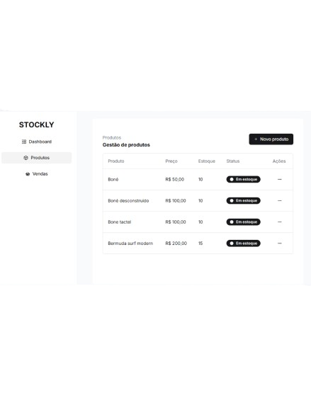

# Project title

Stockly (Stock management).

# Tools used

 
 

Vite + ReactJS + Javascript

# Description

Application created for product stock management.

---

**Screen 📷**

---

## Installation

`git clone https://github.com/ivanmartins090317/stocky.git`

after cloning the repository into yours where you copied it
`cd stocky`

after that:
`npm install`

after that:
`npm run dev`

## Autores

- [Ivan Martins]
   
   
  https://ivanmartins090317.github.io/linktree/

## Functions

- Product creation in stock.
- Change of product in stock.
- Deleting a product from stock.
- Sale with stock calculation.

## Improvements

- Insert A.I. to help improve stock.

## Project structure

Layer structure and use of SOLID, making the structure cleaner and easier to maintain.
